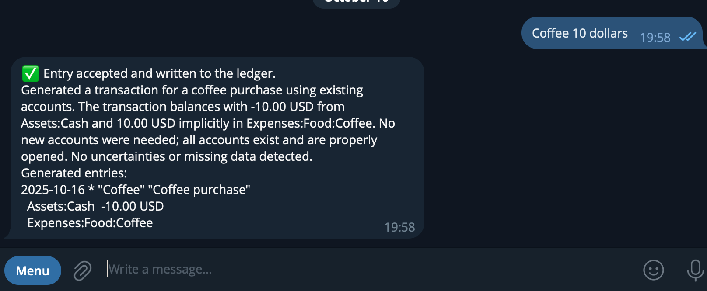
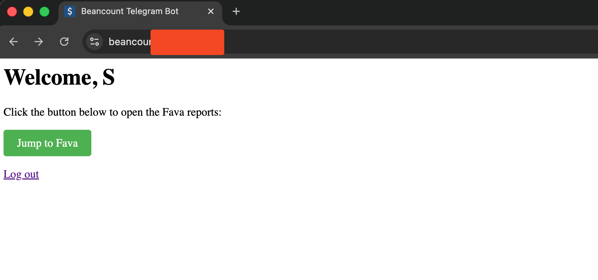
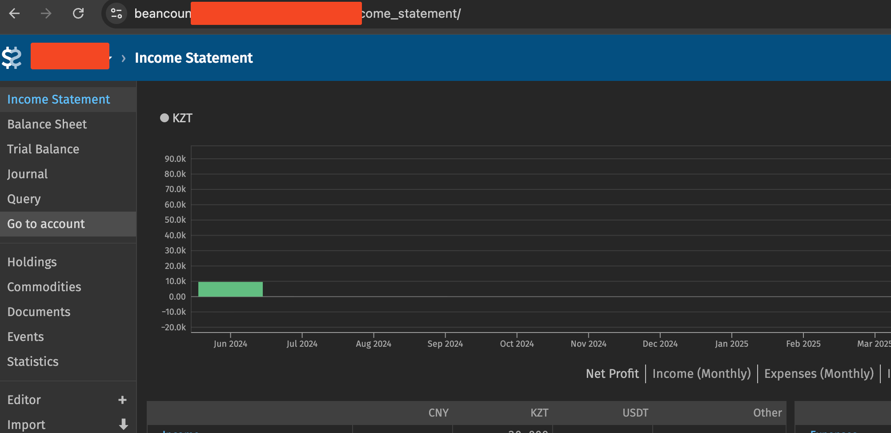

## Features
- Natural-language to balanced Beancount entries
- OCR for forwarded PDFs and screenshots
- Per-user ledgers with persistent storage
- Built-in Fava dashboard for each telegram user

## Deploy
1. `mv .env.example .env` and fill in the Telegram token plus LLM credentials.
2. `mv compose.yml.example compose.yml` and adjust volume paths if needed.
3. `docker compose up -d`

## Screenshots

